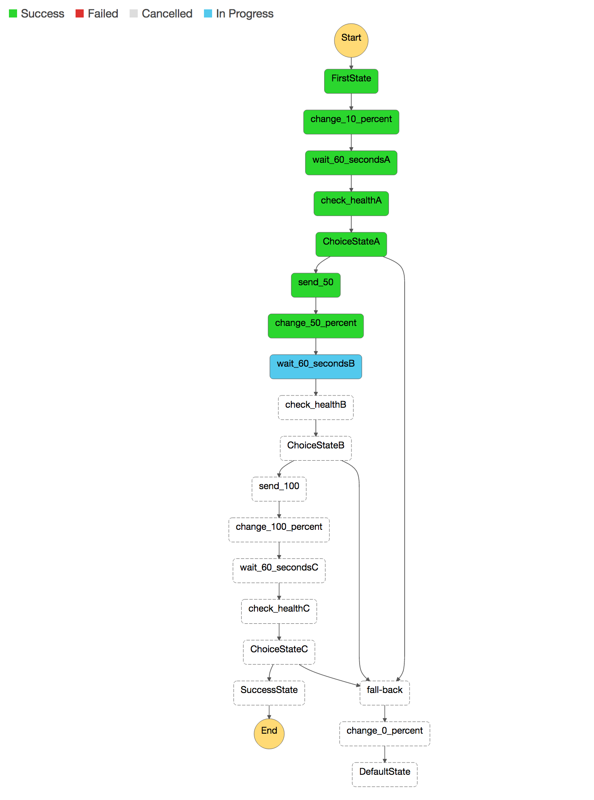

# Canary Blue/Green deployments on ECS

This reference architecture is a companion to the blog post on 
[canary blue green deployments on ECS](https://aws.amazon.com/blogs/compute/ecs.../). 
In order to provide an automated and safe method of migrating traffic from a blue deployment
to a green one, this solution leverages Route53 weights to adjust the traffic flow from one ECS service to another.
We associate a new service with a separate Application Load Balancer, leveraging ECS Event Streams 
to trigger the deployment. Once triggered, Step Functions handle the transitioning of traffic 
off of the blue ALB to the green one. If the Step Function detects a failure of the green service,
it will automatically fail-back to the original configuration. This solution does not destroy the original service, 
so it does offer a safe and reliable method of transitioning traffic, including natural "connection-draining". Users will have to shutdown their old "blue" infrastructure manually once the cut-over is complete.
The one concern users may have is that DNS propogation delay of approximately 60 seconds will be introduced between migration
increments.


## Pre-Requisites
This example uses [AWS Command Line Interface](http://docs.aws.amazon.com/cli/latest/userguide/cli-chap-welcome.html) to run the steps below.

Please follow [instructions](http://docs.aws.amazon.com/cli/latest/userguide/installing.html) if you haven't installed AWS CLI. Your CLI [configuration](http://docs.aws.amazon.com/cli/latest/userguide/cli-chap-getting-started.html) need PowerUserAccess and IAMFullAccess [IAM policies](http://docs.aws.amazon.com/IAM/latest/UserGuide/access_policies.html) associated with your credentials.

Verify that your AWS CLI is installed and up to date.
```console
aws --version
```
## Get going in four steps

#### 1. Create a new S3 bucket from which to deploy our source code (ensure that the bucket is created in the same AWS Region as your network and services will be deployed - which should be <us-east-1>):

```console
$ aws s3 mb s3://<MY_BUCKET_NAME>
```

#### 2. Clone this repo

```console
git clone https://github.com/nbrandaleone/canary-blog.git
```

#### 3. Run bin/deploy setup script to start your blue "service" 
```console
bin/deploy deploy-setup
```

#### 4. Run bin/deploy deployment script to start "green" service
```console
bin/deploy deploy-newservice
```

The first CloudFormation setup script will create a self-contained environment in which to test a canary blue-green deployment. 

Here are the inputs required to launch CloudFormation templates:
  * **S3 Bucket**: Enter S3 Bucket for storing your CloudFormation templates and scripts. This bucket must be in the same region where you wish to launch all the AWS resources created by this example. For now, this region should be <us-east-1>.
  * **CloudFormation Stack Name**: Enter CloudFormation Stack Name to create stacks. Defaults to "canary-setup".
  * **HostedNameZone**: Your domain name. Defaults to "test.net."
  * **RecordSetName**: Enter your sub-domain name. This will point at your Application Load Balancer, where your ECS Service will be registered. Defaults to "myservice".

It will take about 15 minutes to create all the resource, so get a cup of coffee. When you return, check out your Route53 hosted zone.  You will have a new one, along with a new VPC and ECS instances plus a running task/service. If your DNS name and subdomain were valid, you can hit those addresses to see your "blue" container response. If not, you can simply watch things work by going to your ALB's directly and observing your StepFunction and Route53 records.

The second CloudFormation template creates the resources that will look for your new "green" container, and react accordingly. As soon as it completes building, it will automatically trigger the canary deployment.


This solution requires a DynamoDB table to maintain state, and to link your original blue service (and associated LoadBalancer info) with the newer green service.  This is necessary since we will use [Event Streams](http://docs.aws.amazon.com/AmazonECS/latest/developerguide/ecs_cwet_handling.html) to trigger the Route53 weights from the blue to the green service.  However, Amazon ECS sends events on an "at least once" basis. This means you may receive more  than a single copy of a given event. Additionally, events may not be delivered to your event listeners in the order in which the events occurred. We will use a small table to keep track of state, so we do not trigger the process more than once. This DynamoDB table is called "CanaryTable".


A sample entry in the DynomoDB table looks like the above diagram. If you want to test out your own services, you will have to update the table AND update the lambda function (blue color in diagram) which filters the Event stream.

## Testing

Once the second CloudFormation script completes, the new green ECS service will be stared within seconds.  Monitor both the Route53 HostedZone screen, along with the StepFunction console. You will see the weights change slowly at first, and then faster.  The StepFunction has a GUI where you can visualize these changes.


A few notes on the above test procedure:

## Cleaning Up

To clean-up delete the CloudFormation scripts in reverse order. You must delete the ALB records in the Route53 HostedZone manually, or you will get a "delete-failure".


## Resources created in this exercise <UPDATE>

Count | AWS resources 
| --- | --- |
7   | [AWS CloudFormation templates](https://aws.amazon.com/cloudformation/)
1   | [Amazon VPC](https://aws.amazon.com/vpc/) (10.215.0.0/16)   
1  | [AWS CodePipeline](https://aws.amazon.com/codepipeline/) 
2  | [AWS CodeBuild projects](https://aws.amazon.com/codebuild/) 
1  | [Amazon S3 Bucket](https://aws.amazon.com/s3/) 
1  | [AWS Lambda](https://aws.amazon.com/lambda/) 
1  | [Amazon ECS Cluster](https://aws.amazon.com/ecs/) 
2  | [Amazon ECS Service](https://aws.amazon.com/ecs/) 
1  | [Application Load Balancer](https://aws.amazon.com/elasticloadbalancing/applicationloadbalancer/) 
2  | [Application Load Balancer Target Groups](https://aws.amazon.com/elasticloadbalancing/applicationloadbalancer/) 
 

<UPDATE>

#### [DeploymentPipeline](templates/deployment-pipeline.yaml)

  Resources that compose the deployment pipeline include the CodeBuild project, the CodePipeline pipeline, an S3 bucket for deployment artifacts, and all necessary IAM roles used by those services.

#### [Service](templates/service.yaml)

  An ECS task definition, service, IAM role, and ECR repository for the sample application. This template is used by the CodePipeline pipeline to deploy the sample service continuously.

#### [Cluster](templates/ecs-cluster.yaml)

  An ECS cluster backed by an Auto Scaling group of EC2 instances running the Amazon ECS-optimized AMI.

#### [Load Balancer](templates/load-balancer.yaml)

  An Application Load Balancer to be used for traffic to the sample application.

#### [VPC](templates/vpc.yaml)

  A VPC with two public subnets on two separate Availability Zones, an internet gateway, and a route table with a default route to the public internet.

## License

This reference architecture sample is [licensed][license] under Apache 2.0.


[continuous-deployment]: https://aws.amazon.com/devops/continuous-delivery/
[architecture]: images/architecture.pdf
[license]: LICENSE
